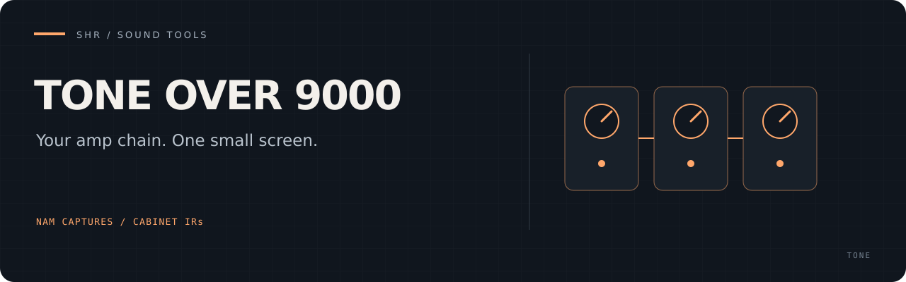

# SHR Tone Over 9000

**A compact NAM amp simulator for Raspberry Pi 5.** Chain up to four `.nam`
captures and cabinet impulse responses in one Rust process, controlled from a
40×13 terminal with touch and MIDI input.

[Quick start](#quick-start) · [Models and cabinets](docs/OPERATING_GUIDE.md#models-cabinets-and-controls) · [TONE3000 search](docs/OPERATING_GUIDE.md#smart-tone3000-search) · [Troubleshooting](docs/OPERATING_GUIDE.md#troubleshooting)

### Pedal → amp → cabinet

- **Build your chain:** combine local NAM captures and WAV cabinet IRs in any order.
- **Find a sound:** browse the starter catalog or search TONE3000 from the terminal.
- **Keep playing while you browse:** model preparation, authentication and downloads run outside the audio loop.

The current processor is **mono, 48 kHz**, with oversampling off and no EQ.
It attaches to an existing JACK server and leaves server configuration alone.

## Quick start

On 64-bit Debian 12/13 with rustup installed, the helper installs native
prerequisites, fetches the NAM core and builds the pinned Rust release:

```sh
git clone https://github.com/PaolaShultz/shr-tone-over-9000.git
cd shr-tone-over-9000
scripts/install.sh --system-deps
$HOME/.local/bin/shr-tone-over-9000 --help
```

This also installs five CC0 cabinet IRs. To install the curated TONE3000 NAM
captures for local use, review their terms and add `--accept-t3k`.

Add `$HOME/.local/bin` to your `PATH` if needed.

With your JACK server running at 48 kHz:

```sh
shr-tone-over-9000
```

The default route is `system:capture_1` → processor → `system:playback_1`.
Use `--capture-port` and `--playback-port` for your exact interface ports.
The [build guide](docs/OPERATING_GUIDE.md#raspberry-pi-5-build) includes manual setup and the exact
Rust 1.97.1 pin.

## Documentation

- [Operating guide](docs/OPERATING_GUIDE.md) — setup, controls, routing and troubleshooting.

## License

[MIT](LICENSE) for the application. Downloaded NAM models, cabinet IRs and
external build dependencies retain their own licenses and source terms.
See the [model catalog](assets/model-catalog.tsv) for asset provenance.
